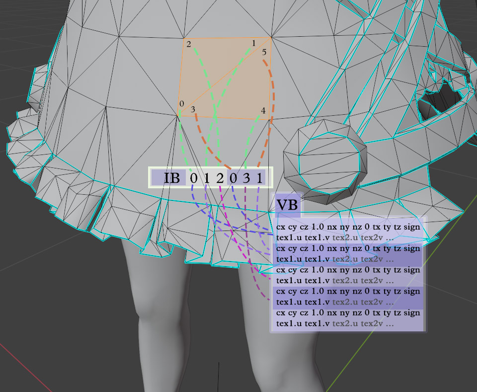

# ZZZ Object Import/Export

## Export

For objects, different from characters, there's only one vertex-buffer (only vb0 and no vb1 and vb2).

The vertex-buffer holds loop (a.k.a. face corner) coordinates, split normals, tangents, and uv data.

"Wait, if it is a loop buffer, why is it called 'vertex-buffer'?"
Dunno, people like giving bad names for things.

Important: The game only expects triangles for polygons. Remember to "Triangulate faces" before executing the script. Also, blender needs to be on "Object mode" for the script to work.

```py
import bpy, os, numpy

def export_object(name:str, mesh, vb_fmt="4f2,4i1,4i1,2f2"):
    def inb(vv, q): return -vv[0], vv[2], -vv[1], q
    ib, vb0, index_map = [], [], {}
    for l in [mesh.loops[i+2-i%3*2] for i in range(len(mesh.loops))]:
        uvs = [layer.data[l.index].uv for layer in mesh.uv_layers]
        h = (l.vertex_index, *uvs[0], *l.normal)
        if h not in index_map:
            index_map[h] = len(vb0)
            vb0.append((inb(mesh.vertices[l.vertex_index].co, 1.),
                        inb(l.normal * 127., 0),
                        inb(l.tangent * 127., -l.bitangent_sign),
                        *[(u, 1 - v) for u, v in uvs]))
        ib.append(index_map[h])

    numpy.fromiter(ib, numpy.uint16).tofile(f"{name}-ib.buf")
    numpy.fromiter(vb0, numpy.dtype(vb_fmt)).tofile(f"{name}-vb0.buf")

os.chdir(r"C:\Users\urmom\Documents\create\mod\zzmi\Mods\MyObjectMod")
mesh0 = bpy.context.selected_objects[0].data
export_object("MyObjectIsNowHorny", mesh0)
```

The whole thing is like 20 lines, but there's a lot of stuff in each of them.

## How does it work?

```py
import bpy, os, numpy
```

`bpy` is how python communicates with blender.
`os` is how python communicates with the Operational System.
`numpy` is the soul of this method of importing data. It's a very fast way of dealing with binary stuff and parallel execution.

```py
def export_furniture(name:str, mesh, vb_fmt="4f2,4i1,4i1,2f2"):
```

Our function call. The `vb_fmt` is the format for each loop stored in the vb0. By default, it is:
- `4f2` (four 2-byte floats, three for coordinates x, y, z, and one that's always 1.0 (no idea what it represents))
- `4i1` (four 1-byte signed integers, three for split normals x, y, z, and one that's always 0)
- `4i1` (four 1-byte signed integers, three for tangents x, y, z, and one for the bitangent sign, that's always 1.0 or -1.0)
- `2f2` (two 2-byte floats, representing the x and y of a texture map)

the `vb_fmt` is defined as a parameter with a default value because **it can be different**. I've seen objects with an extra texture map, and in that case the param needs another `2f2` at the end.

```py 
def inb(vv, q): return -vv[0], vv[2], -vv[1], q
```
The rotate/invert function. It rotates your object so it appear the same in-game as it appear in blender. Most importantly, it flips the x-axis, one of the main reasons I wrote this script myself. The `q` parameter is passed to the end of the returned tuple, as a handy way to deal with the fixed values for coordinates, split normals and the bitangent sign.

```py
ib, vb0, index_map = [], [], {}
```

initializes the two buffers and the index_map, that holds what loops have already been considered for storing. This is a good time to explain how the index buffer and the vertex buffer work together.

Programmers could just store the data for each loop in a sequence and that'd be enough to reconstruct the object in-game, but that would result in **a lot of repeated data**. You see, it is very common for face-corners to have the same position, the same split-normals, and the same texture coordinates. It is the case for every time a face meets another in a smooth surface.

To tackle that, the vertex buffer only stores non-repeated data, and the index buffer maps the sequence of loops to the correspondent data stored in the vertex buffer.

Example: the first three loops form the first triangle of the 3d object. Their data are stored in the vb, and in the ib we store "use vb block 0, use vb block 1, use vb block 2". For the second triangle, we also have three loops, but two of the corners are the same as two from the first triangle. In this case, we can store only the data for the different loop in the vb, and in the ib we store "use vb block 0, use vb block 3, use vb block 1".



The `index_map` then stores the index for each data combination, mapping to it's position on the vb.

```py
for l in [mesh.loops[i+2-i%3*2] for i in range(len(mesh.loops))]:
```
This line iterates the loops. Instead of just being `for l in mesh.loops` we have to do a little trick here. You see, if we just iterated the loops in order, we would end up with our whole model with **flipped faces**. Loops list faces corners counterclockwise, and when we invert the x-axis we make so the outside and the inside of the faces are switched.
To avoid that, this reverses every 3 loops, so instead of reading [0, 1, 2, 3, 4, 5, ...], we read [2, 1, 0, 5, 4, 3, ...].

```py
uvs = [layer.data[l.index].uv for layer in mesh.uv_layers]
```
Here we just separate the texture coordinates for each UVMap to use later.

```py
h = (l.vertex_index, *uvs[0], *l.normal)
if h not in index_map:
    index_map[h] = len(vb0)
```
The `h` variable will be the key for the `index_map`

As described in the ib-vb relation, we detect here if this isn't a repeated loop data. Repeated data will be skipped.

We store the current index (that is vb0's current length) on the map using the `h` key.

```py
vb0.append((inb(mesh.vertices[l.vertex_index].co, 1.),
            inb(l.normal * 127., 0),
            inb(l.tangent * 127., -l.bitangent_sign),
            *[(uv[0], 1 - uv[1]) for uv in uvs]))
```
The `vb0` variable is a tuple of tuples. We append a new item, using the `inb` function for coordinates, normals and tangent.
The normal and the tangent are normalized vectors, so each axis can vary from -1.0 to 1.0. we multiply them by 127.0 so numpy can automatically transform it to int8 (-128 to 127).
For the UV values, we destructure them using a `*`. We also invert the vertical texture coordinate so the game textures can be exactly the ones used in blender (I was tired of flipping images vertically).

```py
ib.append(index_map[h])
```
After that, we add the index to the ib. Note that this will refer to a pre-existing value if the `if` was skipped, or to the values we just appended to the vb0 otherwise.

```py
numpy.fromiter(ib, numpy.uint16).tofile(f"{name}-ib.buf")
numpy.fromiter(vb0, numpy.dtype(vb_fmt)).tofile(f"{name}-vb0.buf")
```
Lastly, we save the ib and vb0 to `.buf` files. Note that the game originally uses uint16 for each index in the ib, but if our model has more than 2¹⁶ (65536) values stored in the vb0, we will need to change it to unit32.

## Usage example

```py
os.chdir(r"C:\Users\urmom\Documents\create\mod\zzmi\Mods\MyObjectMod")
mesh0 = bpy.context.selected_objects[0].data
export_object("MyObjectMod", mesh0)
```
With `chdir` we can change the current directory we're in, so the generated files get created directly in the mod folder. This makes testing really fast, as we can run the script, hit f10, and already see any changes in game.
The `mesh0` holds the data for the current selected object.

## TL;DR
There's no TL;DR, Read the damn thing. If you really want to get how this works, you'll have to take your time to learn it. 
